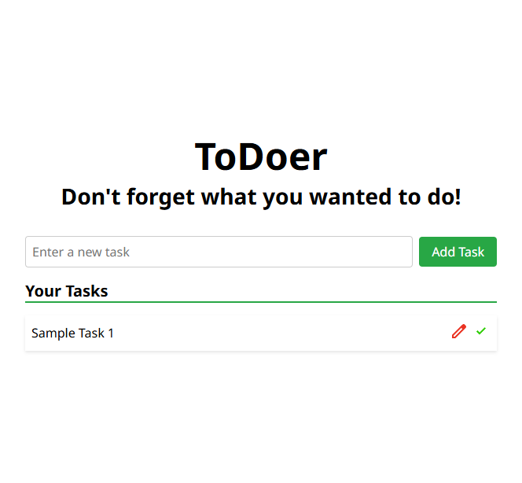

# ToDoer

A simple, lightweight to-do list web application built with **HTML**, **CSS**, and **vanilla JavaScript**.



## 🚀 Live Demo

Check out the live version here:  
[itsnazarkhani.github.io/ToDoer](https://itsnazarkhani.github.io/ToDoer)

## 📖 Features

- Add new tasks  
- Edit existing tasks  
- Mark tasks as done (delete)  

## 🛠️ Built With

- HTML  
- CSS  
- JavaScript

## 📂 Getting Started

To run this project locally:

1. Clone the repository:  
   ```bash
   git clone https://github.com/itsnazarkhani/ToDoer.git
